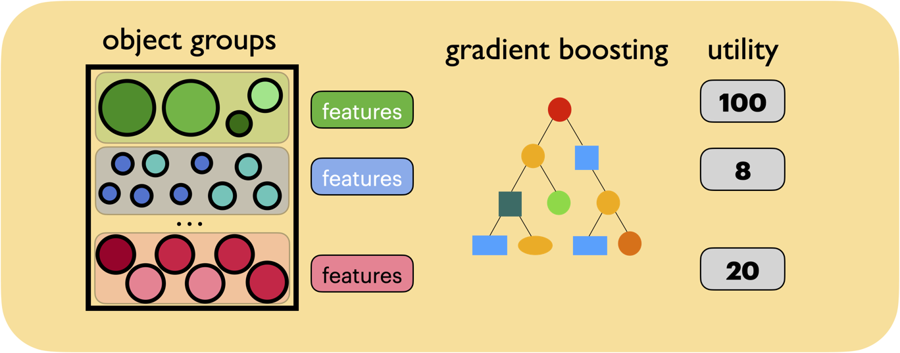

# GL-Cache: Group-level learning for efficient and high-performance caching
This repo contains code for FAST'23 paper: [GL-Cache: Group-level learning for efficient and high-performance caching](https://www.usenix.org/conference/fast23/presentation/yang-juncheng)




#### Abstract
Web applications rely heavily on software caches to achieve low-latency, high-throughput services. To adapt to changing workloads, three types of learned caches (learned evictions) have been designed in recent years: object-level learning, learning-from-distribution, and learning-from-simple-experts. However, we argue that the learning granularity in existing ap- proaches is either too fine (object-level), incurring significant computation and storage overheads, or too coarse (workload or expert-level) to capture the differences between objects and leaves a considerable efficiency gap.

In this work, we propose a new approach for learning in caches (“group-level learning”), which clusters similar objects into groups and performs learning and eviction at the group level. Learning at the group level accumulates more signals for learning, leverages more features with adaptive weights, and amortizes overheads over objects, thereby achieving both high efficiency and high throughput.

We designed and implemented GL-Cache on an open- source production cache to demonstrate group-level learning. Evaluations on 118 production block I/O and CDN cache traces show that GL-Cache has a higher hit ratio and higher throughput than state-of-the-art designs. Compared to LRB (object-level learning), GL-Cache improves throughput by 228× and hit ratio by 7% on average across cache sizes. For 10% of the traces (P90), GL-Cache provides a 25% hit ra- tio increase from LRB. Compared to the best of all learned caches, GL-Cache achieves a 64% higher throughput, a 3% higher hit ratio on average, and a 13% hit ratio increase at the P90.

## Repo structure 
The repo has two parts, micro-implementation and prototype. 

### Micro-implementation
The micro-implementation is a cache implementation that only performs metadata operation. 
It is a snapshot of [libCacheSim](https://github.com/1a1a11a/libCacheSim). 
See the [README](micro-implementation/README.md) in the micro-implementation folder for more details.

### Prototype
The prototype is implemented in Rust based on a snapshot of [Pelikan Segcache](https://github.com/pelikan-io/pelikan).
See the [README](prototype/README.md) in the micro-implementation folder for more details.

### Traces
The traces we used are all public, and a binary version of the traces can be found at [https://ftp.pdl.cmu.edu/pub/datasets/twemcacheWorkload/fast23_glcache/](https://ftp.pdl.cmu.edu/pub/datasets/twemcacheWorkload/fast23_glcache/)

The traces are [zstd](https://github.com/facebook/zstd) compressed and have the following format:
```c
struct {
    uint32_t timestamp;
    uint64_t obj_id;
    uint32_t obj_size;
    int64_t next_access_vtime;  // -1 if no next access
}
```
You can use the compressed trace in the micro-implementation, however, if you use the prototype, you need to decompress the trace first.


### License
Copyright 2023, Carnegie Mellon University

Licensed under the Apache License, Version 2.0 (the "License");
you may not use this file except in compliance with the License.
You may obtain a copy of the License at

    http://www.apache.org/licenses/LICENSE-2.0

Unless required by applicable law or agreed to in writing, software
distributed under the License is distributed on an "AS IS" BASIS,
WITHOUT WARRANTIES OR CONDITIONS OF ANY KIND, either express or implied.
See the License for the specific language governing permissions and
limitations under the License.


### Support
This work was supported in part by Facebook Fellowship, NSF grants CNS 1901410, CNS 1956271, CNS 1763617, and a AWS grant.


### Citation
```bibtex
@inproceedings{yang2023gl,
  title={GL-Cache: Group-level learning for efficient and high-performance caching},
  author={Yang, Juncheng and Mao, Ziming and Yue, Yao and Rashmi, K.V.},
  booktitle={21st USENIX Conference on File and Storage Technologies (FAST 23)},
  pages={115--134},
  year={2023}
}
``` 


